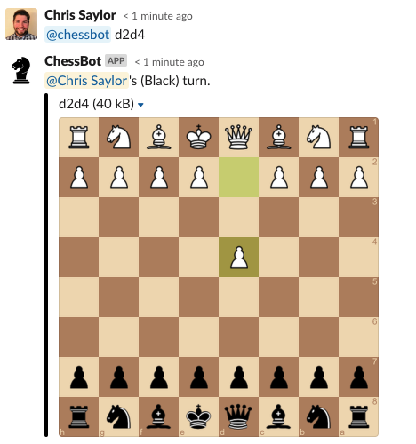
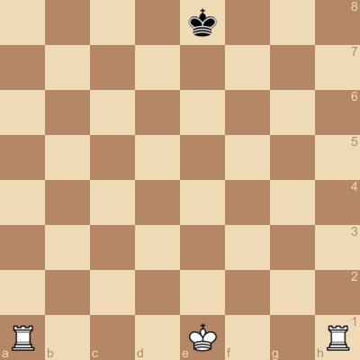
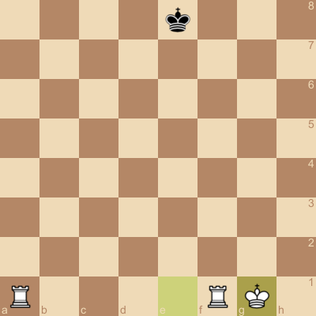
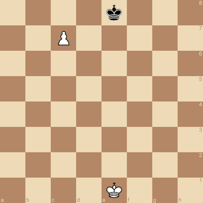
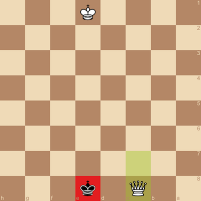

# Making Moves

ChessBot makes use of Long Algebraic Notation (LAN), which is basically referencing the grid directly.

Ranks are indicated by number (`1-8`) and files are indicated by lettter (`a-h`)

In order to make a move, mention `@chessbot` and give a LAN grid move:

```
@chessbot d2d4
```



## Castling

Consider the following simplified board:



We can do a king-side castle by moving the king at `e1` to `g1`:

```
@chessbot e1g1
```



Queen-side castle would be similar:

```
@chessbot e1c1
```

## Piece Promotion

`ChessBot` supports minor piece promotion. Suppose we have a simplified board setup where we want to promote the white pawn.



We can promote the white pawn to a queen by issuing the following move command:

```
@chessbot c7c8q
```




### Promotion List

| letter notation | example | result |
|---------------|-------|------|
| q | c7c8q | Promote to Queen |
| n | c7c8n | Promote to Knight (Under-promotion) |
| r | c7c8r | Promote to Rook (Under-promotion) |
| b | c7c8b | Promote to Bishop (Under-promotion) |

---

_Images created by [`cjsaylor/chessimage`](https://github.com/cjsaylor/chessimage)_
